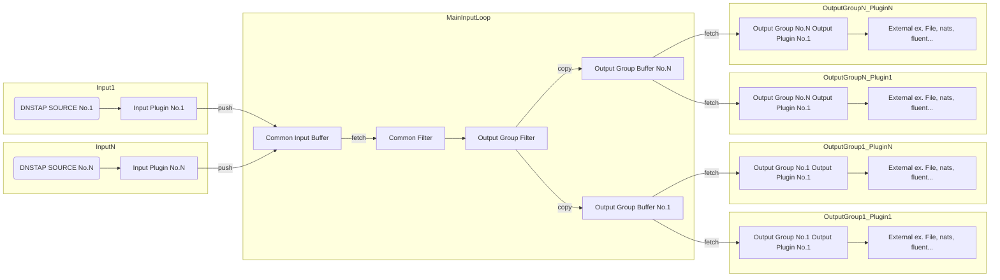

# design

## DNSTAP frame journey

1. Input plugins are input frames to the input buffer.
2. The main controller fetches frames from the input buffer.
3. Fetched Frames are filtered and modified by global filters.
4. Filtered frames are copied for all output groups. And It is filtered and modified by output group filters. After It pushes to the output group buffer.
5. Output plugins are part of output groups that fetch frames from the output group buffer. And It sends to external. 

## Frame flow

